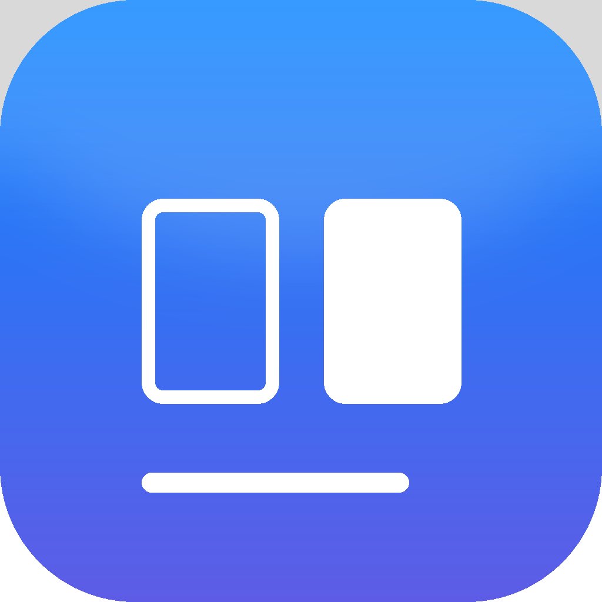

<div align="center">
  
  <h1>Refract Image</h1>
  <p><strong>Reference-guided AI image editing, running on your Mac.</strong></p>
  <p>Refract Image is a macOS app for local AI image editing on Apple silicon. Add up to ten reference images, describe the change, then compare the result with the source.</p>
  <p>
    <a href="https://github.com/DehydratedFlask/Refract-Image/releases/latest"></a>
  </p>
  <p>
    <a href="https://github.com/DehydratedFlask/Refract-Image/releases/latest"></a>
    
    
    
  </p>
</div>

---

## Why Refract Image?

Refract Image is for editing with a visual reference without sending the generation request to a hosted AI editor. After the model is downloaded, generation runs locally through MLX; references, outputs, and model files stay in folders you choose.

| Workflow | Where generation runs | What to expect |
| --- | --- | --- |
| **Refract Image** | On your Apple silicon Mac | One-time runtime and model downloads; local storage and unified memory are required. |
| Hosted image editor | On the provider's service | Convenient setup; data handling and availability depend on that provider. |
| Raw model tooling | Locally, when configured | Direct access to model tools, with more setup and terminal work. |

## Features

- **Reference-guided edits:** use up to ten images to guide a prompt-based edit.
- **Side-by-side and wipe comparison:** inspect what changed against the original references.
- **A local image library:** browse generated results, revisit jobs, and organize work into projects.
- **Model choices:** start with Qwen-Image-2.1 or FLUX.2 Klein 4B; the model manager exposes additional local sources.
- **Storage you control:** choose where the runtime, model downloads, references, and generated images live.
- **A native Mac app:** use Finder file pickers, drag images in and results out, and keep work in a resizable desktop window.

## Download and install

1. Download the latest **Refract Image DMG** from [GitHub Releases](https://github.com/DehydratedFlask/Refract-Image/releases/latest).
2. Open the DMG and drag **Refract Image.app** to **Applications**.
3. Open the app, choose where to keep its runtime and model data, and install a model. The model is downloaded on first setup and is not bundled in the DMG.

The setup wizard uses [`uv`](https://docs.astral.sh/uv/) to prepare the Python runtime. Install it first if needed; with Homebrew, run `brew install uv`. Fresh setup resolves the latest compatible Python packages and downloads the selected model from its upstream default revision. The model is fetched separately after the runtime is ready. The initial runtime and model downloads need an internet connection.

> The 0.0.1 app is ad-hoc signed and is not notarized. If macOS blocks the first launch, Control-click **Refract Image.app**, choose **Open**, then confirm in the dialog.

## Compatibility

| Requirement | Details |
| --- | --- |
| macOS | 13 or later |
| Processor | Apple silicon; the current build targets arm64 |
| Unified memory | 32 GB or more recommended; smaller configurations may be constrained by model and image size |
| Free disk space | Allow at least 30 GB for initial setup and model staging |
| Network | Required for the first runtime and model downloads; generation runs locally once setup is complete |

The model weights are downloaded from their upstream publishers and keep their own terms. Refract Image does not include model weights in the source repository or DMG.

## How it works

The native Swift and AppKit shell owns the window and local service. A React interface runs in `WKWebView`, while a Python service runs inference through MLX and mflux. The service listens on loopback on the same Mac.

The repository keeps the product pieces separate:

| Directory | Contents |
| --- | --- |
| `app/` | React, TypeScript, and Vite interface |
| `backend/` | Python service, model setup, storage, and backend source tests |
| `native/` | Swift and AppKit macOS shell and app icon |
| `scripts/` | Local setup, development, app-bundle, and DMG build scripts |
| `docs/` | Interface design notes |

## Build from source

Builds require macOS, Apple silicon, Xcode Command Line Tools, Node.js, and `uv`.

```bash
brew install uv node
./scripts/bootstrap.sh
./scripts/make-swift-app.sh
./scripts/make-dmg.sh 0.0.1
```

The app bundle embeds the built interface and the first-run setup payload. Python runtime dependencies and model weights are installed separately when the app is first opened. Source setup resolves the latest releases allowed by the dependency ranges; new major versions require an intentional range change and compatibility review. The checked-in npm lockfile remains unchanged and supports reproducible builds with `npm ci`.

For UI development, run `./scripts/dev.sh` for the native window with Vite hot reload, or `./scripts/dev.sh --web` to work in a browser. To install the backend's development-only test tools, run `uv pip install --python .runtime/bin/python -e 'backend[dev]'`. Backend tests live under `backend/tests/`; the UI has a type-check script at `app/package.json`.

## FAQ

### Does Refract Image send my reference images to a cloud service?

No. The app sends generation requests to its local service on the same Mac. Model files are downloaded from upstream sources during setup; the image-generation call itself runs locally.

### Can I use Refract Image without an internet connection?

After the runtime and a model are installed, image generation runs locally. Internet access is needed to set up or download another model.

### Does Refract Image run on Intel Macs?

No. The app uses MLX and this release targets Apple silicon Macs.

### Are model files included in the download?

No. The DMG contains the app and setup payload. Choose a model in the app and it downloads separately; model publishers' terms apply to those files.

---

<div align="center">
  <strong>Start editing with Refract Image</strong><br />
  <a href="https://github.com/DehydratedFlask/Refract-Image/releases/latest">Download the latest macOS DMG</a>
</div>
